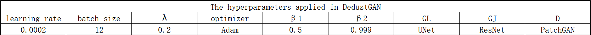
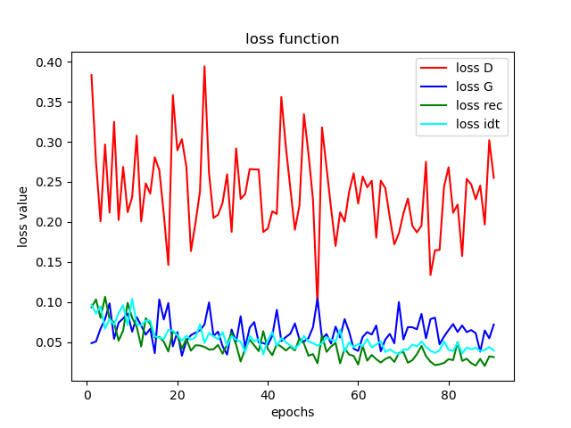
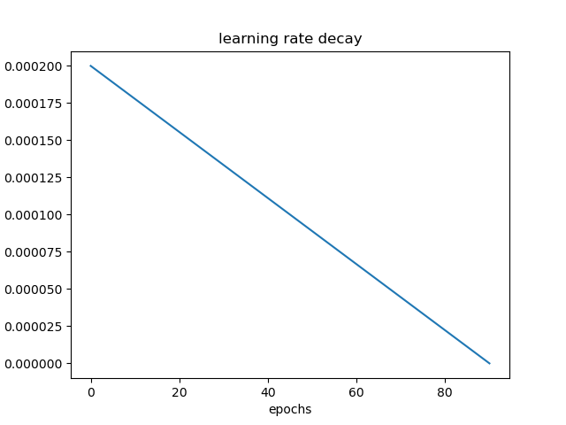

# code for DedustGAN
Thanks to Shiyu Zhao: [RefineDNet-for-dehazing](https://github.com/xiaofeng94/RefineDNet-for-dehazing),the code refers to their work.

# Datasets
The indoor synthetic dusty dataset we used is derived from Jiayan Huang's SIDNet: A single image dedusting network with color cast correction, you can download it by the [link](https://pan.baidu.com/s/1S-bZ-gTcDSa72OpNVsl-qg)(c0kq).

# Checkpoints
We provide pre-trained weights on synthetic dusty dataset SID and unpaired real dusty dataset.[link](https://pan.baidu.com/s/1AZCzl2tBw-Wl3QuwLNTtqg)(54uh).We also provide some samples testd with real pre-trained weight.[link](https://pan.baidu.com/s/1Jyy7h5pFq5N2pq3Ipv2LVg)(mr9f)   
提取码：54uh

# Train
```
python train.py --dataroot [dataset_path] --dataset_mode unpaired --model Dedust --name [experiment_name] --niter 30 --niter_decay 60 --lr_decay_iters 10 --preprocess scale_min_and_crop --load_size 300 --crop_size 256 --nu
m_threads 0 --save_epoch_freq 3
```
# Test
```
python test.py --dataroot ./datasets/test --dataset_mode single --name [experiment_name] --model Dedust --phase test --preprocess none --save_image --method_name [method_name] --epoch 60
```
# Hyperparameters

# Loss

# Learning rate

